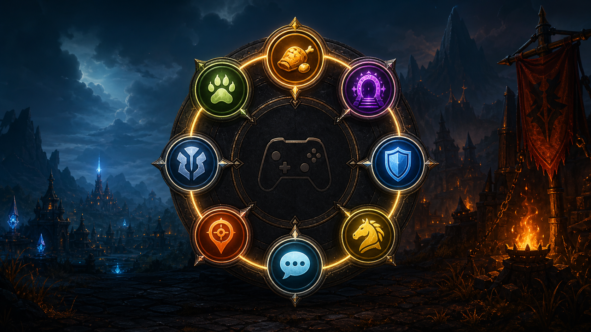
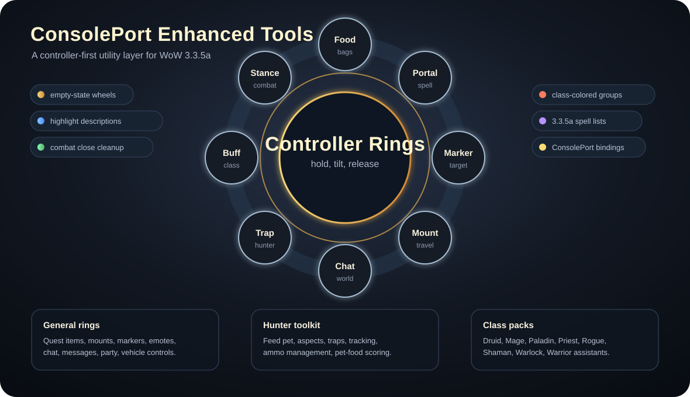

# ConsolePort Enhanced Tools

<p align="center">
  
</p>

<p align="center">
  
  
  
  
</p>

**ConsolePort Enhanced Tools** gives WoW 3.3.5a controller players a set of
fast radial rings for the small things that constantly clog action bars:
feeding pets, swapping aspects, dropping markers, using quest items, mounting,
opening chat, sending quick messages, casting class buffs, choosing portals,
using poisons, totems, stances, and more.

Hold a button. Tilt. Release. Done.

<p align="center">
  
</p>

## Why Use It?

Because utility actions are important, but they do not deserve half your bar.

- Hunters can feed pets, swap aspects, pick traps, and manage ammo without digging through bags.
- Leveling characters get quick mounts, quest items, consumables, emotes, markers, chat, and party tools.
- Mages get portals, teleports, and conjures without turning the UI into a spellbook landfill.
- Paladins, Shamans, Druids, Warlocks, Warriors, Priests, and Rogues get class-specific rings instead of one messy pile.
- Empty rings still open and tell you what is missing, so you know whether you lack the item, spell, pet, poison, mount, or vehicle state.

## What You Get

| Pack | Rings |
| --- | --- |
| **General** | Quest Item, Marker, Mount, Emote, Quick Message, Chat, Track, Consumables, Profession, Party, Vehicle Control |
| **Hunter** | Feed Pet, Aspect, Trap, Ammo |
| **Druid** | Form, Buff |
| **Mage** | Portal, Teleport, Food/Drink |
| **Paladin** | Aura, Seal, Blessing |
| **Priest** | Buff |
| **Rogue** | Poison |
| **Shaman** | Totem, Weapon Imbue, Shield, Utility |
| **Warlock** | Daemon, Stone, Summon |
| **Warrior** | Stance, Shout |

The binding list is split into readable groups like **ConsolePort Enhanced
General**, **ConsolePort Enhanced Hunter**, **ConsolePort Enhanced Mage**, and
so on. The class word is colored, so the group you want is much easier to find.

## Good Starter Rings

| Situation | Bind These First |
| --- | --- |
| **Leveling** | Mount, Quest Item, Consumables, Quick Message, Chat |
| **Dungeons** | Marker, Party, Consumables, class buff ring, defensive/utility ring |
| **Raiding** | Marker, Consumables, class maintenance ring, Quick Message |
| **Hunter Main** | Feed Pet, Aspect, Trap, Ammo, Track |
| **Mage Taxi** | Portal, Teleport, Food/Drink |
| **World PvP** | Mount, Marker, Consumables, class utility ring, Chat |

## Ring Feel

1. Bind a ring in ConsolePort.
2. Hold the binding to open it.
3. Move with your stick or movement keys to highlight a slot.
4. Read the center text if you need the description.
5. Release the binding to use the selected action.

No cursor hunting. No bag panic. No action bar archaeology.

## Highlights

### Feed Pet Assistant

Scans your bags for pet food, checks your current pet diet, rates the food by
pet level, and lets you feed from a ring. Bad food is obvious before you waste it.

### Marker Ring

Drop raid target icons quickly while moving. Useful for dungeon pulls, group
coordination, and marking the thing everyone should stop hitting last.

### Mount Ring

Shows learned companion mounts and a dismount option when mounted. Simple,
fast, and better than scrolling through mount clutter.

### Chat and Quick Messages

Open Say, Party, Raid, Guild, Battleground, whisper target, or reply from a
ring. Quick Message sends common world messages like invite, thanks, ready, and
follow using the last chat channel you used.

### Class Rings

Each class gets its own utility shelf:

- **Druid:** forms and buffs.
- **Mage:** portals, teleports, conjures.
- **Paladin:** auras, seals, blessings.
- **Priest:** buffs.
- **Rogue:** poisons from bags.
- **Shaman:** totems, imbues, shields, utility.
- **Warlock:** daemon summons, stones, utility summons.
- **Warrior:** stances and shouts.

## Combat Reality

WoW 3.3.5a protects some UI actions during combat. The addon uses secure buttons
where the client allows it and avoids unsafe chat/UI calls where it does not.

- Spell and item rings can use secure actions prepared out of combat.
- Chat-opening and quick-message actions are disabled in combat to avoid blocked-action errors.
- If combat starts while a ring is open, the ring closes and clears directional state.
- Opening the game menu also closes enhanced rings if one gets stuck.

## Install

1. Install [ConsolePortLK](https://github.com/leoaviana/ConsolePortLK).
2. Copy `ConsolePortEnhancedTools` into `Interface/AddOns`.
3. Enable `ConsolePort Enhanced Tools` on the addon screen.
4. Open ConsolePort bindings.
5. Bind the rings you want from the `ConsolePort Enhanced ...` groups.

## Slash Commands

Use `/cpet <ring>` or `/cpe <ring>`.

```text
/cpet feed
/cpet mount
/cpet marker
/cpet chat
/cpet portal
/cpet poison
/cpet totem
/cpet stance
```

Use `/cpet` with no known ring name and the addon will print the available ring
keys in chat.

## Requirements

- World of Warcraft 3.3.5a
- ConsolePortLK

## Version

Current release: `2026.05.10.2`

The banner is concept art for the README, not an in-game screenshot.
